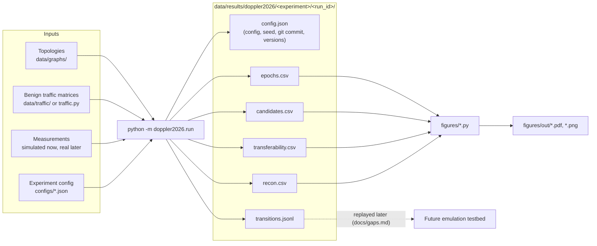

# Data flow

From inputs to paper figures. Every figure and table is regenerated from saved
result files, never edited by hand (`docs/results_schema.md`).

```mermaid
flowchart LR
    subgraph in["Inputs"]
        topo["Topologies<br/>data/graphs/"]
        tm["Benign traffic matrices<br/>data/traffic/ or traffic.py"]
        meas["Measurements<br/>simulated now, real later"]
        cfg["Experiment config<br/>configs/*.json"]
    end

    runner["python -m doppler2026.run"]

    subgraph out["data/results/doppler2026/&lt;experiment&gt;/&lt;run_id&gt;/"]
        c["config.json<br/>(config, seed, git commit, versions)"]
        ep["epochs.csv"]
        ca["candidates.csv"]
        tf["transferability.csv"]
        rc["recon.csv"]
        tj["transitions.jsonl"]
    end

    figs["figures/*.py"]
    pdf["figures/out/*.pdf, *.png"]
    testbed["Future emulation testbed"]

    topo & tm & meas & cfg --> runner
    runner --> c & ep & ca & tf & rc & tj
    ep & ca & tf & rc --> figs --> pdf
    tj -.->|"replayed later (docs/gaps.md)"| testbed
```
